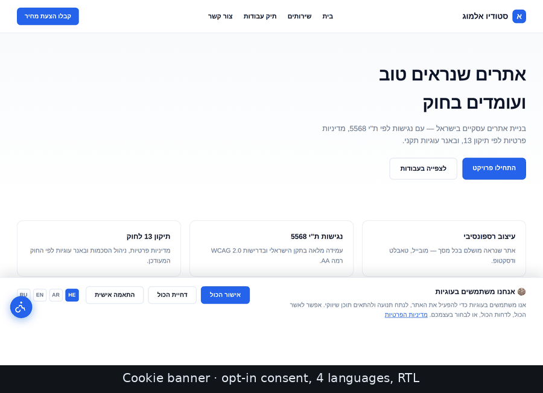

# Web Compliance Prompts

AI coding prompts for **website legal compliance**, composed against
per-jurisdiction rule packs. Pick what you're building and which markets the
site serves; the skill assembles a filled-in prompt you paste into Cursor,
Claude Code, or any AI coding assistant.

Ships packs for **Israel** (Amendment 13, IS 5568), the **EU/EEA** (GDPR,
ePrivacy, European Accessibility Act), the **UK** (UK GDPR, PECR), the
**US** (CAN-SPAM, COPPA, ADA federally; CCPA/CPRA and Global Privacy Control
for California) and **Canada** (PIPEDA, Québec Law 25, CASL, AODA). Output in
**Hebrew, Arabic, English or Russian**, with RTL support.

> ## ⚠️ Not legal advice
>
> These prompts and the documents they generate are **templates for
> informational purposes only** and do **not** constitute legal advice. Laws
> change and every situation differs. Before publishing any policy, contract,
> disclaimer, or accessibility statement produced with these prompts, have it
> reviewed by a **qualified lawyer** licensed in the relevant jurisdiction.
> Use at your own risk; no warranty is provided.
>
> **Every jurisdiction pack is currently marked `needs_legal_review: true`** —
> the citations are sourced but have not been signed off by a practitioner in
> any of these jurisdictions.

---

## How it works (in plain words)

It's a box of ready-made legal prompts for websites — cookie banners, privacy
policies, accessibility widgets, terms of use, and more. You don't write the
legal wording; you say what you're building and which markets the site serves,
and it hands you a filled-in prompt to paste into an AI coding assistant
(Cursor, Claude Code, …) that then builds it.

1. **Install it once** (see [Install](#install)).
2. **Ask in plain words** — *"give me the cookie banner prompt."*
3. **Answer a few questions** — which markets (Israel? EU? UK? US? Canada?), which
   language (Hebrew / Arabic / English / Russian), and your details (business
   name, brand color, framework).
4. **Paste the prompt** it emits into your AI coding assistant, which builds the
   artifact into the site.

One template (say `cookie-banner`) serves Israel, the EU, the UK or California —
the jurisdiction pack supplies the rules, the template supplies the build. See
[How it's structured](#how-its-structured) for why that split matters.

> Every user works the same way: install, ask, answer, paste. Output is tailored
> to *their* site and *their* markets — nothing is hosted or shared.

---

## What it produces

Example output built to the `cookie-banner` and `accessibility-widget`
templates, on a sample Hebrew RTL business site.



> A ~7s tour of the four states below. Same screenshots, in motion — not a hosted demo.

| Cookie banner | Granular consent preferences |
|---|---|
|  |  |

| Accessibility widget | High contrast + 120% text |
|---|---|
|  |  |

> Screenshots of example output, not a hosted demo. Your own output matches your
> brand color, language, framework and jurisdictions.

---

## How it's structured

```
skills/web-compliance/
  SKILL.md              # composes template × jurisdiction(s)
  templates/            # WHAT to build — jurisdiction-neutral (13 artifacts)
  jurisdictions/        # WHICH rules apply — cited, dated, machine-readable
    il.yaml             # Israel
    eu.yaml             # EU / EEA
    uk.yaml             # United Kingdom
    us.yaml             # US federal layer
    us-ca.yaml          # California (extends: us)
scripts/validate.py     # structural checks, run in CI
docs/screenshots/
```

Templates and jurisdictions are deliberately separate. One `cookie-banner`
template serves Israel, the EU and California without being forked — the pack
supplies the rules, the template supplies the build.

## The 13 artifacts

| Artifact | Template |
|---|---|
| 🍪 Cookie Banner (Consent Mode v2) | `templates/cookie-banner.md` |
| 📄 Privacy Policy | `templates/privacy-policy.md` |
| ♿ Accessibility Widget | `templates/accessibility-widget.md` |
| 🌐 Full-Site Accessibility Baseline | `templates/accessibility-baseline.md` |
| 📋 Accessibility Statement | `templates/accessibility-statement.md` |
| 📜 Freelancer Contract | `templates/freelancer-contract.md` |
| 📜 Terms of Use | `templates/terms-of-use.md` |
| 💳 Refund & Cancellation Policy | `templates/refund-policy.md` |
| ⚠️ Disclaimer | `templates/disclaimer.md` |
| 🛒 E-Commerce Checkout | `templates/ecommerce-checkout.md` |
| 📧 Email Marketing | `templates/email-marketing.md` |
| 🇪🇺 Data Subject Rights layer | `templates/data-subject-rights.md` |
| 📋 Client Onboarding Questionnaire | `templates/client-onboarding.md` |

## Jurisdiction coverage

| Pack | Frameworks | Consent | Accessibility | Legal review |
|---|---|---|---|---|
| **Israel** `il.yaml` | PPL + Amendment 13 (14 Aug 2025), IS 5568, Equal Rights Law, anti-spam, Contracts Amendment 3 | opt-in | WCAG 2.0 AA | ❌ pending |
| **EU / EEA** `eu.yaml` | GDPR 2016/679, ePrivacy 2002/58/EC Art. 5(3), EAA 2019/882, EN 301 549, WAD 2016/2102 | opt-in | WCAG 2.1 AA | ❌ pending |
| **UK** `uk.yaml` | UK GDPR, DPA 2018, PECR 2003 (Reg. 6 + 22, soft opt-in), Equality Act 2010, PSBAP Regs 2018 | opt-in | WCAG 2.1 AA | ❌ pending |
| **US federal** `us.yaml` | CAN-SPAM, COPPA, ADA Title III, Section 508 | opt-out | WCAG 2.1 AA* | ❌ pending |
| **California** `us-ca.yaml` | CCPA/CPRA, Global Privacy Control, CPPA (`extends: us`) | opt-out | — | ❌ pending |
| **Canada** `ca.yaml` | PIPEDA, Québec Law 25, BC/AB PIPA, CASL, Accessible Canada Act, AODA | opt-in | WCAG 2.0/2.1 AA | ❌ pending |

\* The ADA does not codify a WCAG level for private sites; 2.1 AA is the
practical litigation benchmark, not a statutory mandate.

Planned: more US states, Brazil (LGPD).

**What this structure gets right that a flat prompt set gets wrong:**

- **The cookie banner comes from ePrivacy / PECR, not the GDPR.** GDPR defines
  what valid consent *is*; ePrivacy Art. 5(3) (EU) and PECR Reg. 6 (UK) are what
  require consent before any device storage — `localStorage` and fingerprinting
  included, not just cookies.
- **Consent models are opposite across markets.** EU / UK / Israel are opt-in;
  US states are opt-out. A site serving both must geo-detect and show each
  visitor their own model. Applying the US model globally breaches ePrivacy.
- **Global Privacy Control is code, not policy.** California requires honouring
  `navigator.globalPrivacyControl` — even on a site that otherwise runs an
  opt-in banner.
- **Email consent is inverted.** CAN-SPAM permits sending until opt-out; the EU,
  UK and Israel require prior opt-in. One list across them must be opt-in.
- **Accessibility should target WCAG 2.2 AA.** Statutory floors vary (IS 5568 is
  2.0 AA; the EAA and UK public-sector regs require EN 301 549 → 2.1 AA), but 2.2
  AA (the current standard) is a superset of both, so building to it satisfies
  every pack.
- **`us.yaml` alone is not "US compliant."** There is no general federal privacy
  law — consumer rights come from state packs, and only California ships today.

## Getting it legally reviewed

Every pack ships `needs_legal_review: true` — the citations are sourced but not
signed off by a practitioner, and laws change. Treat the output as a **first
draft** and have a qualified lawyer in the relevant jurisdiction review it
before anything goes live. Here's what that step actually involves.

**Why it matters:** these are legal documents. A wrong privacy policy, a cookie
banner that breaches ePrivacy, or a spam flow that ignores prior opt-in is
regulatory exposure — fines, accessibility lawsuits, unenforceable contracts —
not a cosmetic bug. A template that *looks* authoritative and one that *is*
authoritative are different things; the review closes that gap.

**What to hand the lawyer:**

- The generated document(s), plus which **jurisdiction pack(s)** and **markets**
  they were built for.
- The relevant `skills/web-compliance/jurisdictions/*.yaml` file(s) — each lists
  its frameworks, citations, and `effective` dates, so a lawyer can check them
  against what is currently in force.
- Your client's actual facts: revenue/volume (does CCPA even apply?), whether
  the site targets children (COPPA), what data is collected, and whether any
  public-sector accessibility rules apply.

**Ask them to confirm, at minimum:**

1. The **citations and dates** are current and correct for each market.
2. Consent model is right per market (**opt-in** EU / UK / Israel vs **opt-out**
   US states) and email marketing follows the stricter rule where lists overlap.
3. Scope/thresholds — that each law your document claims actually *applies* to
   this client.
4. The **accessibility target** (WCAG level) is defensible for the site.
5. Anything flagged `needs_verification` in a pack (e.g. Israel's spam statute,
   the ADA WCAG level, the UK Data Use and Access Act's in-force provisions).

**Which packs to prioritize:** review the markets your client actually serves
first, and within those, the documents with legal teeth — **privacy policy,
cookie banner, terms of use, and any contract** — before the lower-risk ones.

Once a pack is signed off, set `reviewed_by` to the reviewing lawyer/firm and
flip `needs_legal_review` to `false` in that YAML file, so the review status is
tracked in the repo.

## Install

```
/plugin marketplace add ward3107/web-compliance-prompts
/plugin install web-compliance@web-compliance
```

Then just ask — *"give me the cookie banner prompt"* — and the skill asks which
markets you serve, which language, and your variables, then emits the filled
prompt.

<details>
<summary>Alternatives without the plugin system</summary>

**Install the skill directly:**
```bash
git clone https://github.com/ward3107/web-compliance-prompts.git
mkdir -p ~/.claude/skills
cp -r web-compliance-prompts/skills/web-compliance ~/.claude/skills/web-compliance
```

**Or by hand:** open any file in `skills/web-compliance/templates/`, replace the
`[BRACKET]` placeholders, and paste it into your AI assistant.
</details>

## Contributing a jurisdiction

See `skills/web-compliance/jurisdictions/README.md`. The rules in short:
no requirement without a citation, mark what you have not verified, date
everything, and record conflicts between jurisdictions rather than silently
resolving them.

Run the checks before opening a PR:

```bash
python3 scripts/validate.py
```

It fails on uncited frameworks, missing `[LANGUAGE]` placeholders, missing
checklists, absent disclaimers, and `extends`/`conflicts` references pointing at
packs that don't exist; it warns on review dates older than a year.

## License

[MIT](LICENSE).
