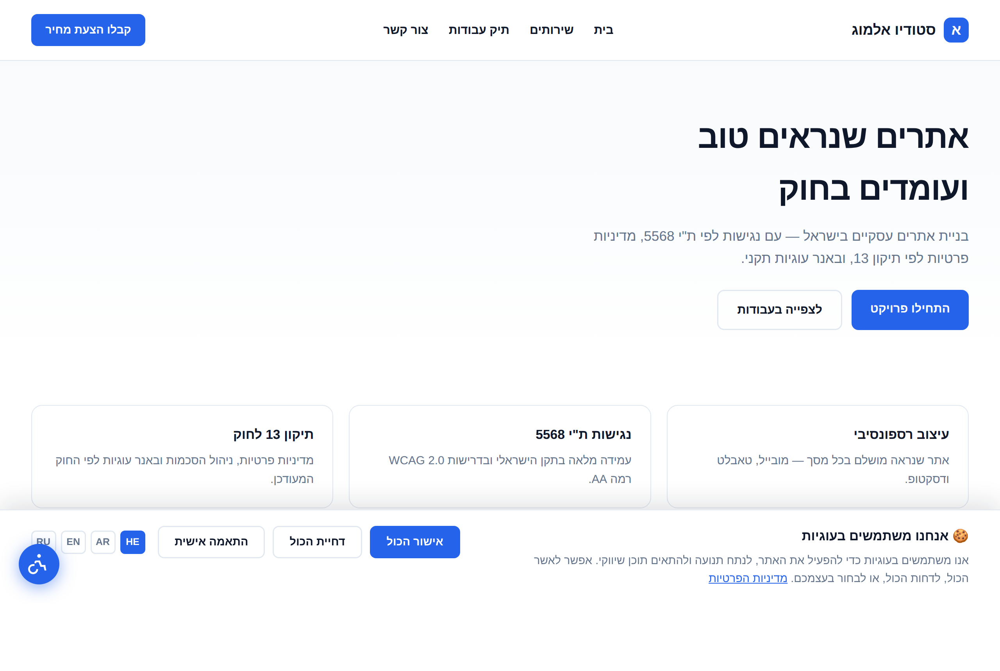
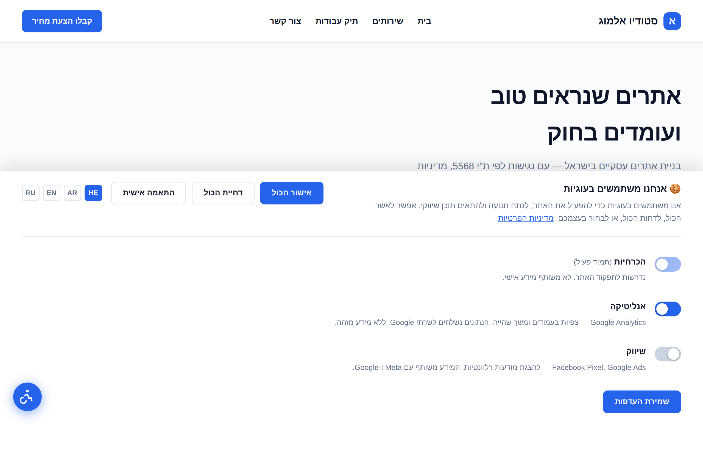
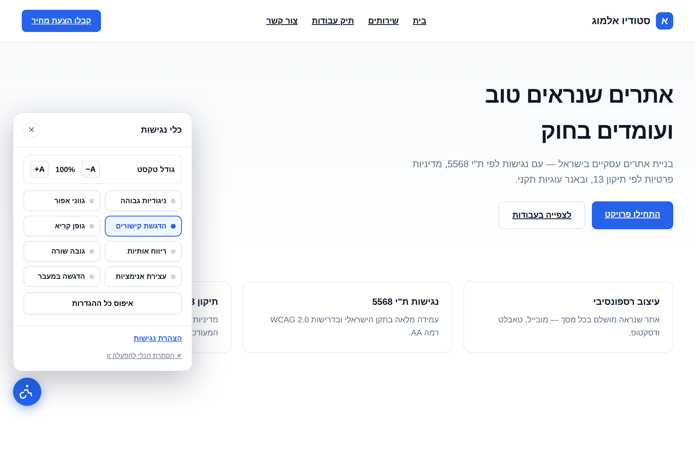
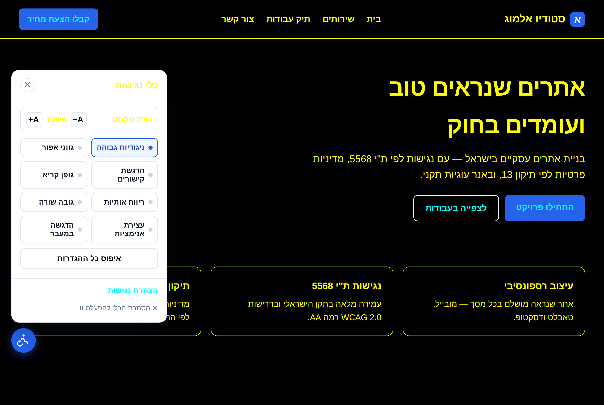

# Web Compliance Prompts

AI coding prompts for **website legal compliance**, composed against
per-jurisdiction rule packs. Pick what you're building and which markets the
site serves; the skill assembles a filled-in prompt you paste into Cursor,
Claude Code, or any AI coding assistant.

Ships packs for **Israel** (Amendment 13, IS 5568), the **EU/EEA** (GDPR,
ePrivacy, European Accessibility Act), the **UK** (UK GDPR, PECR) and the
**US** (CAN-SPAM, COPPA, ADA federally; CCPA/CPRA and Global Privacy Control
for California). Output in **Hebrew, Arabic, English or Russian**, with RTL
support.

> ## ⚠️ Not legal advice
>
> These prompts and the documents they generate are **templates for
> informational purposes only** and do **not** constitute legal advice. Laws
> change and every situation differs. Before publishing any policy, contract,
> disclaimer, or accessibility statement produced with these prompts, have it
> reviewed by a **qualified lawyer** licensed in the relevant jurisdiction.
> Use at your own risk; no warranty is provided.
>
> **Every jurisdiction pack is currently marked `needs_legal_review: true`** —
> the citations are sourced but have not been signed off by a practitioner in
> any of these jurisdictions.

---

## What it produces

Example output built to the `cookie-banner` and `accessibility-widget`
templates, on a sample Hebrew RTL business site.

| Cookie banner | Granular consent preferences |
|---|---|
|  |  |

| Accessibility widget | High contrast + 120% text |
|---|---|
|  |  |

> Screenshots of example output, not a hosted demo. Your own output matches your
> brand color, language, framework and jurisdictions.

---

## How it's structured

```
skills/web-compliance/
  SKILL.md              # composes template × jurisdiction(s)
  templates/            # WHAT to build — jurisdiction-neutral (13 artifacts)
  jurisdictions/        # WHICH rules apply — cited, dated, machine-readable
    il.yaml             # Israel
    eu.yaml             # EU / EEA
    uk.yaml             # United Kingdom
    us.yaml             # US federal layer
    us-ca.yaml          # California (extends: us)
scripts/validate.py     # structural checks, run in CI
docs/screenshots/
```

Templates and jurisdictions are deliberately separate. One `cookie-banner`
template serves Israel, the EU and California without being forked — the pack
supplies the rules, the template supplies the build.

## The 13 artifacts

| Artifact | Template |
|---|---|
| 🍪 Cookie Banner (Consent Mode v2) | `templates/cookie-banner.md` |
| 📄 Privacy Policy | `templates/privacy-policy.md` |
| ♿ Accessibility Widget | `templates/accessibility-widget.md` |
| 🌐 Full-Site Accessibility Baseline | `templates/accessibility-baseline.md` |
| 📋 Accessibility Statement | `templates/accessibility-statement.md` |
| 📜 Freelancer Contract | `templates/freelancer-contract.md` |
| 📜 Terms of Use | `templates/terms-of-use.md` |
| 💳 Refund & Cancellation Policy | `templates/refund-policy.md` |
| ⚠️ Disclaimer | `templates/disclaimer.md` |
| 🛒 E-Commerce Checkout | `templates/ecommerce-checkout.md` |
| 📧 Email Marketing | `templates/email-marketing.md` |
| 🇪🇺 Data Subject Rights layer | `templates/data-subject-rights.md` |
| 📋 Client Onboarding Questionnaire | `templates/client-onboarding.md` |

## Jurisdiction coverage

| Pack | Frameworks | Consent | Accessibility | Legal review |
|---|---|---|---|---|
| **Israel** `il.yaml` | PPL + Amendment 13 (14 Aug 2025), IS 5568, Equal Rights Law, anti-spam, Contracts Amendment 3 | opt-in | WCAG 2.0 AA | ❌ pending |
| **EU / EEA** `eu.yaml` | GDPR 2016/679, ePrivacy 2002/58/EC Art. 5(3), EAA 2019/882, EN 301 549, WAD 2016/2102 | opt-in | WCAG 2.1 AA | ❌ pending |
| **UK** `uk.yaml` | UK GDPR, DPA 2018, PECR 2003 (Reg. 6 + 22, soft opt-in), Equality Act 2010, PSBAP Regs 2018 | opt-in | WCAG 2.1 AA | ❌ pending |
| **US federal** `us.yaml` | CAN-SPAM, COPPA, ADA Title III, Section 508 | opt-out | WCAG 2.1 AA* | ❌ pending |
| **California** `us-ca.yaml` | CCPA/CPRA, Global Privacy Control, CPPA (`extends: us`) | opt-out | — | ❌ pending |

\* The ADA does not codify a WCAG level for private sites; 2.1 AA is the
practical litigation benchmark, not a statutory mandate.

Planned: more US states, Canada (PIPEDA / Law 25), Brazil (LGPD).

**What this structure gets right that a flat prompt set gets wrong:**

- **The cookie banner comes from ePrivacy / PECR, not the GDPR.** GDPR defines
  what valid consent *is*; ePrivacy Art. 5(3) (EU) and PECR Reg. 6 (UK) are what
  require consent before any device storage — `localStorage` and fingerprinting
  included, not just cookies.
- **Consent models are opposite across markets.** EU / UK / Israel are opt-in;
  US states are opt-out. A site serving both must geo-detect and show each
  visitor their own model. Applying the US model globally breaches ePrivacy.
- **Global Privacy Control is code, not policy.** California requires honouring
  `navigator.globalPrivacyControl` — even on a site that otherwise runs an
  opt-in banner.
- **Email consent is inverted.** CAN-SPAM permits sending until opt-out; the EU,
  UK and Israel require prior opt-in. One list across them must be opt-in.
- **Accessibility should target WCAG 2.1 AA.** IS 5568 is built on 2.0 AA, but
  the EAA and UK public-sector regs require EN 301 549 → 2.1 AA, a superset.
- **`us.yaml` alone is not "US compliant."** There is no general federal privacy
  law — consumer rights come from state packs, and only California ships today.

## Install

```
/plugin marketplace add ward3107/web-compliance-prompts
/plugin install web-compliance@web-compliance
```

Then just ask — *"give me the cookie banner prompt"* — and the skill asks which
markets you serve, which language, and your variables, then emits the filled
prompt.

<details>
<summary>Alternatives without the plugin system</summary>

**Install the skill directly:**
```bash
git clone https://github.com/ward3107/web-compliance-prompts.git
mkdir -p ~/.claude/skills
cp -r web-compliance-prompts/skills/web-compliance ~/.claude/skills/web-compliance
```

**Or by hand:** open any file in `skills/web-compliance/templates/`, replace the
`[BRACKET]` placeholders, and paste it into your AI assistant.
</details>

## Contributing a jurisdiction

See `skills/web-compliance/jurisdictions/README.md`. The rules in short:
no requirement without a citation, mark what you have not verified, date
everything, and record conflicts between jurisdictions rather than silently
resolving them.

Run the checks before opening a PR:

```bash
python3 scripts/validate.py
```

It fails on uncited frameworks, missing `[LANGUAGE]` placeholders, missing
checklists, absent disclaimers, and `extends`/`conflicts` references pointing at
packs that don't exist; it warns on review dates older than a year.

## License

[MIT](LICENSE).
